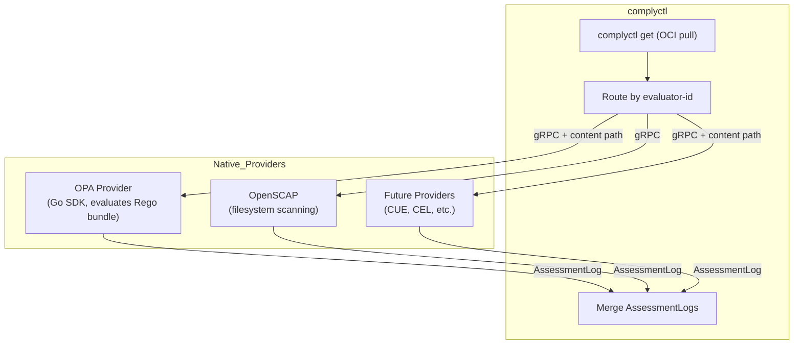
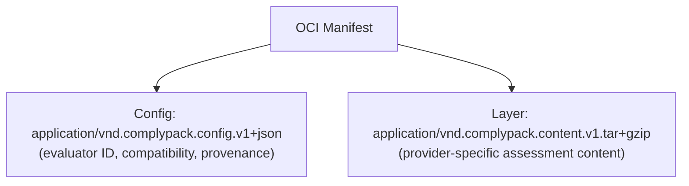
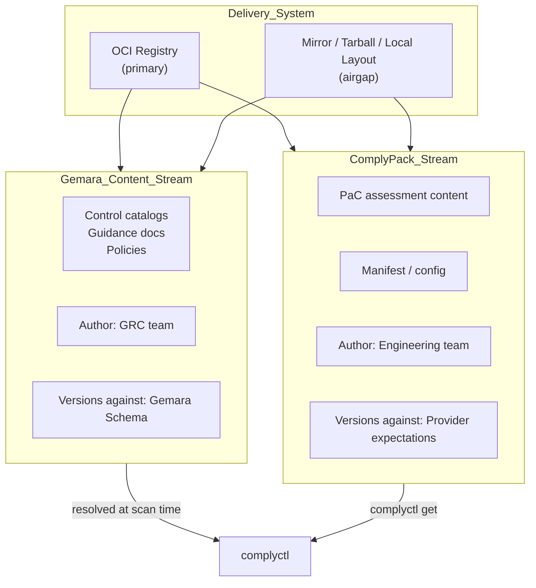

# CEP-0001: ComplyPack Architecture

**Authors:** @jpower432, @trevor-vaughan

**Begin Design Discussion:** 2026-05-07

**Status:** proposed

**Discussion:** https://github.com/complytime/complytime/pull/3

**Checklist:**

- [ ] ComplyPack OCI envelope format defined; `complyctl get` pulls and routes generically
- [ ] OPA native provider delivers evaluation via OPA Go SDK + `complyctl scan`
- [ ] Docs: plugin author guide, operator configuration
- [ ] Tests: integration tests, airgap delivery

## Summary

This CEP proposes **complypacks** — packaged evaluation logic for compliance assessment distributed via OCI. A ComplyPack is a uniform distribution envelope that complyctl pulls, verifies, and delivers to providers without understanding what's inside.

OPA/Rego serves as the first concrete use case: a native Go provider evaluates Rego bundles delivered as ComplyPacks.

## Background

### Motivation and Problem Space

1. **Distribution fragmentation**: Gemara content ships via OCI (`complyctl get`). Plugin binaries ship via RPM or manual placement. Policy-as-code (PaC) assessment content — the declarative files that tell a plugin what to check — has no distribution path at all. The platform engineer manages three independent installation paths to get a working scan.

2. **No content generation methodology**: Gemara defines what must be true (`#Policy`, `#ControlCatalog`). Translating these into executable assessment content is manual, ad-hoc, and inconsistent.

3. **Provider-specific coupling**: If complyctl needs to understand each provider's content format (OPA bundles, CUE policies, CEL expressions), every new evaluator requires complyctl changes. The platform must remain generic.

### Impact and Desired Outcome

ComplyPacks unify the distribution model for compliance evaluation content. A platform engineer pulls one OCI artifact and the correct provider consumes it — no manual content placement, no provider-specific tooling in complyctl.

Compliance engineers gain a structured path from authority documents to executable checks with traceability.

### Prior Discussion and Links

- [PR #3: Initial feature-level spec discussion](https://github.com/complytime/complytime/pull/3) — original complypack specification and community feedback
- [Cupcake](https://cupcake.eqtylab.io/) — compiled Rego Wasm execution model

## User Stories

| **Persona**                 | **Current Pain**                                        | **Desired Outcome**                                                                 |
|:----------------------------|:--------------------------------------------------------|:------------------------------------------------------------------------------------|
| Platform Engineer (SRE)     | Manages three install paths                             | Single pull gets assessment content delivered to the right provider                 |
| Compliance Engineer (GRC)   | Manual translation from standards to checks             | Structured authoring produces Rego from resolved effective policy with traceability |
| Plugin Author (Engineering) | No content distribution path; manual placement          | Publish assessment content as OCI artifact; `complyctl get` delivers it             |

## Goals

1. Single-pull distribution — one `complyctl get` retrieves evaluation logic + assessment content
2. Provider-agnostic envelope — complyctl routes by metadata, never interprets content
3. Two independent content streams — Gemara (compliance-authored) and complypacks (engineering-authored) with distinct authorship boundaries
4. Content authoring contract — defined input/output interface with mandatory security gates
5. Supply chain trust — signed packs with verification enforced by default
6. Airgap support — OCI mirroring or tarball transport without special architecture

## Non-Goals

- **Specific Rego rule structures** — determined during implementation
- **Gemara schema changes** — Gemara content stream is unaffected
- **Sandboxed execution model** — future CEP when community plugin trust requires it (see [Future Considerations](#future-considerations-sandboxed-execution))
- **Gemara-to-Rego authoring methodology internals** — under collaborative design, contributed separately
- **External catalog/curation layer** — future concern when scale demands it
- **OpenSCAP or AMPEL modifications** — those providers are unaffected
- **Implementation task breakdown** — tracked in GitHub Issues and Milestones per repository

## Proposal

A **ComplyPack** is a uniform OCI distribution envelope for packaged evaluation logic. complyctl pulls ComplyPacks generically — it never interprets provider-specific content inside. Routing to the correct provider is based on pack metadata (`evaluator-id`).

The native OPA provider is the first consumer: it receives a ComplyPack containing a standard OPA bundle (Rego source + data), loads it, and evaluates via OPA's Go SDK.

## Design Details

### Terminology

| **Term**         | **Definition**                                                                                                                                                         |
|:-----------------|:-----------------------------------------------------------------------------------------------------------------------------------------------------------------------|
| `#AssessmentLog` | Output of a single provider's evaluation. Contains results for the controls/requirements it assessed. Each provider emits one or more of these.                        |
| `#EvaluationLog` | Merged artifact produced by complyctl from one or more `#AssessmentLog` entries across all providers in a scan.                                                        |
| Comply Pack      | Uniform OCI distribution envelope for packaged evaluation logic. Content is opaque to complyctl; only the provider understands it.                                     |
| Native Plugin    | Go-based gRPC binary that handles collection and loads a Comply Pack for evaluation. Separate from the pack it consumes.                                               |
| Provider         | Any execution unit (native plugin) that performs data collection and/or evaluation.                                                                                    |

### ComplyPack as Distribution Envelope

complyctl cannot handle provider-specific formats. Adding OPA bundle awareness to complyctl creates coupling that doesn't scale — every new evaluator (CUE, CEL, future) would require complyctl changes.

The ComplyPack envelope keeps complyctl generic and providers autonomous:



**Routing:** complyctl checks the ComplyPack's `evaluator-id` metadata and routes to the native provider registered for that ID. The provider receives the content path and knows how to consume its own format.

### OCI Artifact Structure



**Config fields:**
- `evaluator-id` — identifies which provider consumes this pack (e.g., `io.complytime.opa`)
- `version` — pack version (semver)
- `source.gemara_content` — provenance: which Gemara content version this was generated from
- `source.policy_id` — provenance: which policy this implements

**Media type discrimination:** `complyctl get` distinguishes ComplyPacks from Gemara content by the config media type (`application/vnd.complypack.config.v1+json`). Gemara content uses its own config type.

### Local Storage Model

`complyctl get` pulls the OCI artifact and stores it locally in two forms:

| **Store**            | **Purpose**                                                      | **Location**                                            |
|:---------------------|:-----------------------------------------------------------------|:--------------------------------------------------------|
| OCI layout (cache)   | Source of truth. Supports signature re-verification, digest pinning, mirror-back-out. | `~/.complytime/cache/oci/` (standard OCI layout)        |
| Extracted content    | Provider consumption. Predictable path the provider reads from.  | `~/.complytime/packs/<evaluator-id>/<version>/`         |

The provider receives the extracted content path via gRPC and reads files directly from disk. Providers never parse OCI blob structure.

**Trade-off:** This model requires filesystem access — native providers have it, but a future sandboxed (Wasm) execution model cannot read from the host filesystem. In the Wasm model, content is compiled into the plugin binary itself, eliminating the filesystem coupling entirely. This is one motivation for the sandboxed model explored in [Future Considerations](#future-considerations-sandboxed-execution).

### Two-Stream Model

The architecture enforces a strict separation between **what should be true** (Gemara) and **how to verify it** (complypacks).



No artifact-level dependency exists between the two streams. Compatibility is expressed through provenance metadata and validated at runtime by the provider.

### OPA Native Provider

The first ComplyPack consumer. A standard complyctl provider — Go binary, gRPC interface, OPA's Go SDK for evaluation.

**Provider responsibilities:**
- Implements standard gRPC provider interface (Describe, Generate, Scan) — same pattern as AMPEL
- Receives credentials via target variables (same as existing providers)
- Does its own collection using Go `net/http` (autonomous, no complyctl involvement)
- Evaluates via OPA Go SDK (`opa/rego` package) — pure Go
- Receives ComplyPack content path from complyctl, loads Rego bundle from it
- Returns `#AssessmentLog` entries

**ComplyPack content for OPA:** A standard OPA bundle (`.rego` files + `data.json` + bundle manifest). The same format OPA's tooling already produces and consumes. The ComplyPack envelope is the distribution mechanism; the content inside is just an OPA bundle.

### Gemara-to-Rego Content Authoring

Translating Gemara documents into executable policy-as-code is the content generation problem. The Gemara-to-Rego authoring methodology is under active collaborative design.

This section defines the interface contract and security gates — methodology details will be contributed separately by collaborators.

**Interface contract:**

| **Aspect**           | **Specification**                                                                      |
|:---------------------|:---------------------------------------------------------------------------------------|
| Input                | Resolved effective policy — single YAML document with all imports flattened inline     |
| Output               | One `.rego` file per assessment plan                                                   |
| File naming          | Deterministic: `{requirement-id}.rego`                                                 |
| Package naming       | Deterministic: `package complytime.{requirement_id}`                                   |
| Required annotations | Traceability (source policy ID, requirement ID, control objective), schema declaration |

**Rego file convention:**

```rego
# Source: policy_id=cloud-infra-cis, requirement_id=CIS-2.1.1
# Schema: cloud/aws-ec2-config.v1
package complytime.CIS_2_1_1

import rego.v1

# Assessment requirement: [text from #ControlCatalog]
# Control objective: [text from parent control]
```

**Requirement ID to Rego mapping**: Replace `-` and `.` with `_`, prefix with `complytime.`. Example: `CIS-2.1.1` → `package complytime.CIS_2_1_1`. File name preserves original: `CIS-2.1.1.rego`. Mapping is deterministic and reversible via traceability annotation.

**Security gates** (non-negotiable regardless of authoring methodology):
1. `opa check` syntax validation
2. Static analysis for disallowed constructs (e.g., `http.send`, `opa.runtime`)
3. Schema alignment verification
4. Mandatory human review before commit
5. Reproducible inputs (locked policy digest in traceability annotations)

### OCI Distribution and Trust

OCI is the primary transport. Comply Packs transport to airgapped environments via standard mirroring tools (skopeo, oc-mirror, crane, oras) or filesystem-backed OCI layouts.

**Trust chain:**
- Packs are signed with Cosign/Sigstore
- Verification at `complyctl get` time — fail-hard by default
- Content-addressed identity: SHA-256 of content blob is the canonical identifier regardless of source (registry, mirror, filesystem)
- `allow-unsigned` override for local development only

**Trust policy specification:**

| **Aspect**           | **Requirement**                                                                                                                                                                                |
|:---------------------|:-----------------------------------------------------------------------------------------------------------------------------------------------------------------------------------------------|
| Identity allowlist   | Operators configure trusted signer identities (OIDC issuer + subject pairs or key fingerprints). Only packs signed by an identity in the allowlist pass verification.                          |
| Offline verification | Sigstore bundle-based verification (RFC 9162 inclusion proof bundled with signature) enables verification without network access to Rekor. Required for airgapped environments.                |
| Mirrored registries  | Signatures travel with the artifact (attached via OCI referrers API or tag-based fallback). Mirroring tools copy referrers automatically. No special handling needed for signature portability. |
| Digest pinning       | Production pack references use `@sha256:...` digests. Tag-based references are resolved to digests at `complyctl get` time and cached. Re-fetching requires digest match.                      |

**Content safety:** The implementation MUST reject anomalously large or malformed pack content at `complyctl get` time. Path validation (no `..`, no absolute paths, no symlinks) and strict YAML parsing (no unbounded alias expansion) are required. Numeric size limits are implementation details.

## Impacts / Key Questions

### Pros

- **Unified distribution**: One `complyctl get` retrieves assessment content for any provider
- **Provider autonomy**: Providers own their content format. complyctl never interprets it.
- **Existing patterns**: Native provider model is identical to existing providers. No new runtime, no new framework.
- **Incremental**: Ships immediately with OPA. Other evaluators (CUE, CEL) follow the same pattern without complyctl changes.
- **Airgap-ready**: OCI transport works offline via standard mirroring

### Cons

- **New OCI artifact type**: ComplyPack config media type needs to be defined and documented
- **OPA provider is a new binary**: Requires building, distributing, and maintaining `complytime-provider-opa`
- **No sandboxing in native model**: Provider runs with full host privileges (same as all existing providers)

### Key Design Questions

1. **Why an envelope?**: complyctl cannot handle provider-specific formats without coupling. The envelope keeps complyctl generic.
2. **Why OPA Go SDK?**: Pure Go, no CGo, ships immediately. Same Rego source can compile to Wasm later without rewriting.
3. **Evaluator IDs**: Reverse-domain convention (`io.complytime.opa`). No external catalog until scale demands it.
4. **Content authoring methodology**: Interface contract defined; methodology deferred to collaborators.

## Risks and Mitigations

| **Risk**                                                       | **Likelihood** | **Impact** | **Mitigation**                                                                                 |
|:---------------------------------------------------------------|:---------------|:-----------|:-----------------------------------------------------------------------------------------------|
| AI-generated Rego contains subtle logic errors                 | High           | High       | Validation gates, static analysis, human review. Never auto-deployed.                          |
| OPA Go SDK doesn't support all needed Rego features            | Low            | Med        | Standard Rego subset (JSON in → decisions out) is well-supported. Validate during authoring.   |
| Evaluator namespace governance becomes contentious             | Low            | Med        | Start with reverse-domain convention; formalize only if conflicts arise                        |
| ComplyPack format needs revision after initial release         | Med            | Med        | Config media type includes version (`v1`). Breaking changes get a new media type.              |

## Compatibility

### Backward Compatibility

- **Native plugins**: Unaffected. Continue to function as gRPC subprocesses with full host access. No changes required from existing plugin authors.
- **`complyctl get`**: Existing Gemara content artifacts handled identically. ComplyPack detection is additive (config media type discrimination).
- **`complytime.yaml`**: ComplyPack references use the same `url` field as content-only policies. No syntax changes.

### Forward Compatibility

- **Rego to Wasm transition**: OPA Rego source can compile to Wasm via `opa build -t wasm` in the future. Same source, different compilation target. No rewriting needed.
- **Transport abstraction**: Distribution logic is behind an internal interface. Adding transports requires implementing the interface, not changing user-facing commands.
- **New evaluators**: Any provider can consume ComplyPacks by registering for an `evaluator-id`. No complyctl changes required.
- **Airgap deployment**: OCI transport supports airgapped environments via mirror/tarball/local layout. No special architecture needed.

## Acceptance Criteria

1. `complyctl get <complypack-url>` pulls a ComplyPack and delivers content to the correct provider by `evaluator-id`.
2. OPA native provider evaluates Rego bundle from ComplyPack content, producing valid `#AssessmentLog` entries.
3. Native OPA provider and existing providers (OpenSCAP) produce merged results in a single `complyctl scan` invocation.
4. Unsigned pack is rejected by default. Signed pack passes verification.
5. Airgapped delivery (filesystem-backed OCI layout) produces identical scan results to registry-based delivery.
6. Two independent publishers can distribute complypacks for the same technology without evaluator ID collision.

## Implementation Details

### Phase 0: ComplyPack Distribution Format

**Goal:** Define and ship the ComplyPack as a uniform OCI distribution envelope.

| **Step**                                                                                                          | **Deliverable**                                 |
|:------------------------------------------------------------------------------------------------------------------|:------------------------------------------------|
| Define ComplyPack OCI manifest structure (config with `evaluator-id` + opaque content layers)                     | ComplyPack OCI artifact spec                    |
| Extend `complyctl get` to pull ComplyPack artifacts and route to provider by `evaluator-id`                       | `complyctl get` handles ComplyPacks generically |
| Build OPA ComplyPack: standard OPA bundle (`.rego` + `data.json`) as opaque content layer inside envelope         | OPA ComplyPack published to OCI registry        |

### Phase 1: OPA Native Provider

**Goal:** Ship OPA evaluation in complyctl using a native gRPC provider. Pure Go.

| **Step**                                                                                        | **Deliverable**                         |
|:------------------------------------------------------------------------------------------------|:----------------------------------------|
| Create native gRPC OPA provider (same pattern as AMPEL)                                         | `complytime-provider-opa` binary        |
| Implement `Generate` — receive assessment configs, store state                                  | Provider accepts Gemara-derived configs |
| Implement `Scan` — collect data via Go `net/http`, evaluate via OPA Go SDK (`opa/rego` package) | `#AssessmentLog` entries                |
| Provider receives ComplyPack content path from complyctl, loads Rego bundle from it             | Provider consumes its own pack content  |
| Register with complyctl, verify merged `#EvaluationLog` output                                  | End-to-end `complyctl scan` with OPA    |

### Testing Plan

| **Category**               | **Scope**                                                                  | **Phase** |
|:---------------------------|:---------------------------------------------------------------------------|:----------|
| OCI delivery               | `complyctl get` pulls ComplyPack, routes to provider                       | Phase 0   |
| Integration (native model) | Native OPA provider produces correct `#AssessmentLog` via `complyctl scan` | Phase 1   |
| Signature verification     | Unsigned pack rejected; signed pack accepted; tampered pack rejected       | Phase 0   |
| Airgap delivery            | Filesystem-backed OCI layout produces same scan results as registry        | Phase 1   |

## Future Considerations: Sandboxed Execution

The native model has two structural limitations: every provider inherits full host privileges, and content delivery depends on filesystem access (providers read extracted content from disk).

**Triggering conditions** (any one is sufficient):
- Community authors contribute plugins that run on root-context hosts
- Credential isolation between providers becomes a requirement (one plugin must not access another's tokens)
- Resource limit enforcement needed (memory caps, execution timeouts for untrusted logic)
- Eliminating filesystem coupling for content delivery becomes desirable

**What Wasm provides:**
- Structural memory isolation by construction — no runtime policy enforcement needed
- Least-privilege by default — plugins only get explicitly granted capabilities (`wasi:http`)
- Self-contained distribution — content compiles into the binary, no extracted content directory to manage or secure
- Platform-neutral portability — any OS/arch without per-target compilation
- Deterministic evaluation — compiled Rego Wasm produces identical results regardless of host
- Credential confinement — plugins receive only injected tokens, cannot access host env or other plugins' state

**Likely architecture** (two options under consideration):
- **Standalone Rust binary (`complypack-runtime`)** — implements complyctl's gRPC provider interface via go-plugin and hosts Wasm Components via wasmtime natively. Keeps complyctl pure Go (no CGo). Requires Rust expertise for runtime maintenance.
- **wasmtime-go embedded in complyctl** — hosts Wasm Components directly within complyctl using the wasmtime-go bindings. Simpler deployment (no additional binary). Introduces CGo dependency, complicating cross-compilation and CI.

The same Rego source files used in Phase 1 compile to Wasm via `opa build -t wasm` without rewriting. The transition from native OPA provider to Wasm ComplyPack is transparent to complyctl — it still talks gRPC to a provider.

A separate CEP will detail this architecture when the triggering conditions emerge.

## Future Considerations: Signal Providers (RAG as Advisory Input)

The self-contained pack model evaluates collected structured data deterministically. A future extension adds **signal providers** — non-authoritative enrichment sources that provide advisory input to evaluation logic.

The pattern (demonstrated by Cupcake's Watchdog): a signal provider evaluates evidence using a non-deterministic method (RAG over documentary evidence, LLM-as-judge) and returns a structured judgment. This judgment is injected into the evaluator's input as a signal — not a verdict. The deterministic policy engine makes the authoritative compliance decision.

Applied to ComplyTime: a RAG signal provider could evaluate whether internal procedures and attestation documents satisfy an assessment requirement, returning `{satisfies, confidence, reasoning, evidence_refs}` as `input.signals.rag`. The compiled Rego then incorporates this signal alongside collected structured data to produce the final assessment result.

This keeps RAG advisory, preserves deterministic evaluation as authoritative, and fits cleanly into the existing pack architecture — signal providers are just another data source available at `input.signals.*`.

## References

- [PR #3: Initial feature-level spec discussion](https://github.com/complytime/complytime/pull/3)
- [OCI Image Spec — Artifact guidance](https://github.com/opencontainers/image-spec)
- [Sigstore/cosign — OCI artifact signing](https://github.com/sigstore/cosign)
- [Open Policy Agent — Go SDK](https://www.openpolicyagent.org/docs/latest/integration/)
- [Cupcake — Rego → Wasm policy enforcement](https://cupcake.eqtylab.io/) (eqtylab; demonstrates compiled Rego Wasm execution model)
